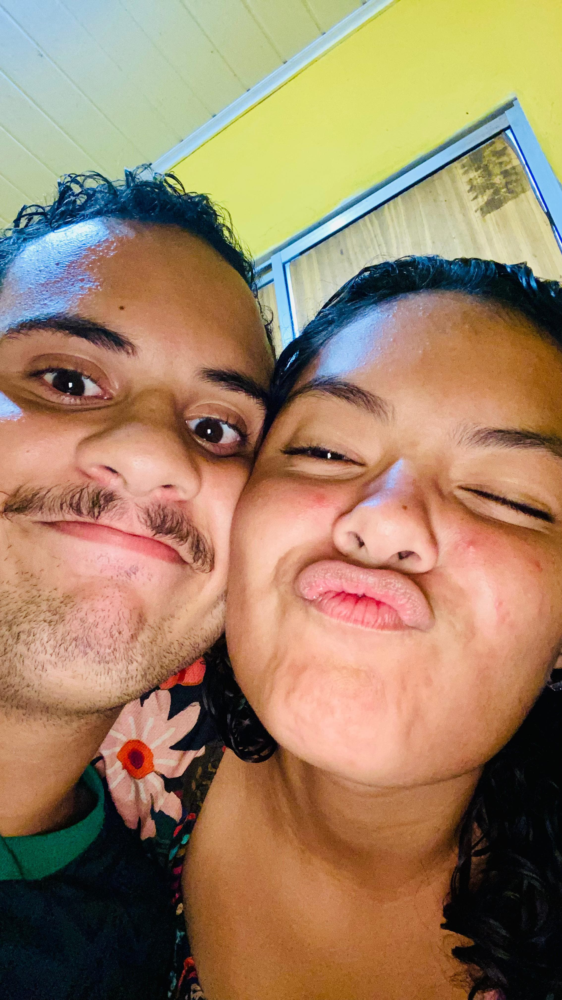

<html lang="pt-br">
<head>
  <meta charset="UTF-8">
  <title>Caio & Letícia</title>
  <meta name="viewport" content="width=device-width, initial-scale=1.0">
  
</head>
<body>
  

  <h1>💖 Caio & Letícia 💖</h1>
  
<strong>Música:</strong> Space & Time - Rafael Witt

  

  <button id="btnMusica" onclick="controlarMusica()">▶ Tocar Música</button>
  <button onclick="mostrarFoto()">🎁 Ver Surpresa</button>

  <audio id="musica" loop>
    <source src="musica.mp3" type="audio/mpeg">
    Seu navegador não suporta áudio.
  </audio>

  

    
    

  

  
</body>
</html>
